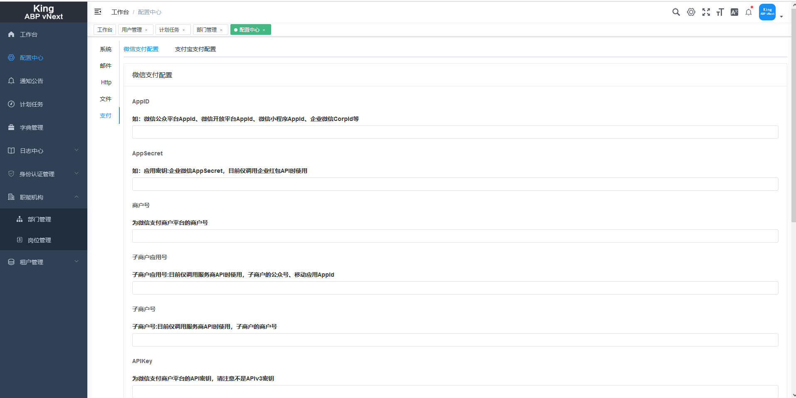
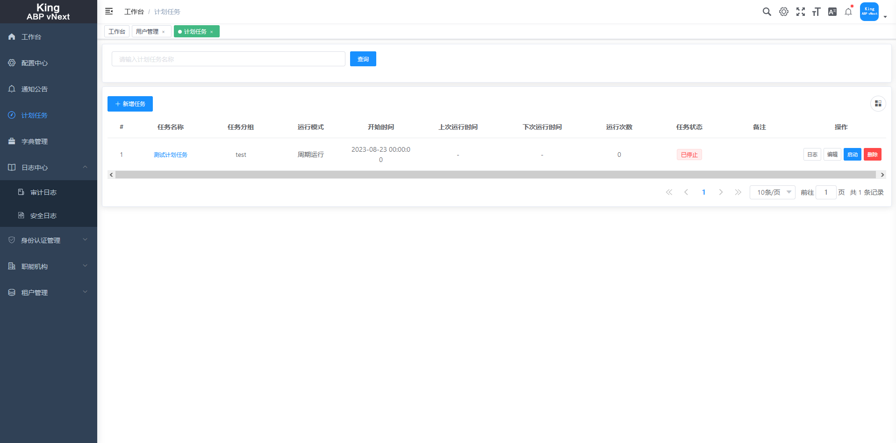
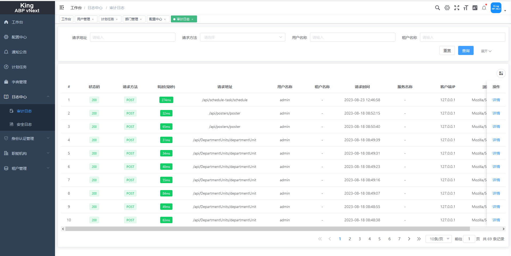
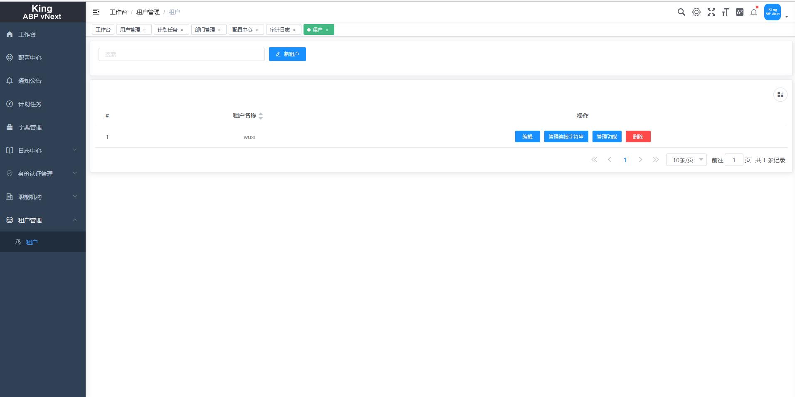
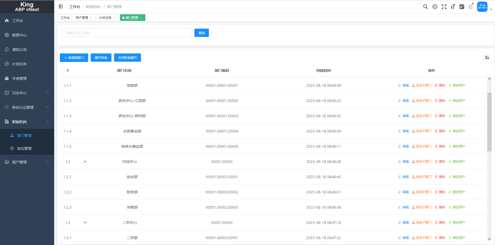
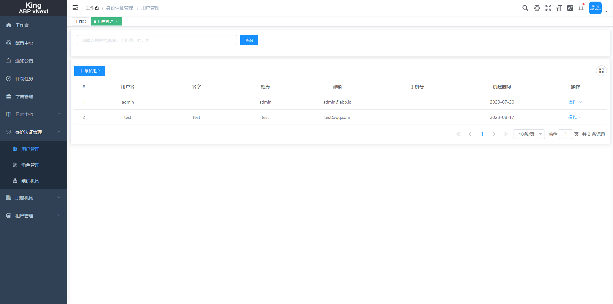

# 连接

1. [文档地址](https://menglou.github.io/)
   
2. [Gitee 国内用户可访问该地址在线预览](https://zljlm.gitee.io/king-abpvnext-pro)
   
3. [预览地址](http://36.156.141.246:6890)(默认账号：King , 密码:King1q2w3E*)

# 快速开始

1. 安装Cli
>dotnet tool install -g Kings.AbpVnextPro.Cli
2. 更新Cli
>dotnet tool update -g  Kings.AbpVnextPro.Cli  --no-cache
3. 卸载Cli
>dotnet tool uninstall -g Kings.AbpVnextPro.Cli 

# 生成项目

+ identityserver4 
  - nuget包形式的identityserver4 鉴权方式的版本
  - abp vnext  自带的所有模块，pro 的通知模块,数据字典，文件管理，职能机构，支付中心,计划任务
>king.abp new -t pro.id4.all -c 公司名称 -p 项目名称 -v 版本(默认LastRelease) -o 默认当前控制台执行目录

 - nuget包形式的identityserver4 鉴权方式的版本
  - abp vnext  只有基础模块，通知模块
>king.abp new -t pro.id4.simplify -c 公司名称 -p 项目名称 -v 版本(默认LastRelease) -o 默认当前控制台执行目录

+ openiddict
  - nuget包形式的openiddict 鉴权方式的版本
  - abp vnext  自带的所有模块，pro 的通知模块,数据字典，文件管理，职能机构，支付中心，计划任务
>king.abp new -t pro.openiddict.all -c 公司名称 -p 项目名称 -v 版本(默认LastRelease) -o 默认当前控制台执行目录

  - nuget包形式的openiddict 鉴权方式的版本
  - abp vnext  只有基础模块，通知模块
>king.abp new -t pro.openiddict.simplify -c 公司名称 -p 项目名称 -v 版本(默认LastRelease) -o 默认当前控制台执行目录

# 功能

### 功能列表

<ul class="condition">
<li>用户管理</li>
<li>角色管理</li>
<li>审计日志</li>
<li>登录日志</li>
<li>计划任务</li>
<li>集成事件</li>
<li>SinglaR 消息通知(站内信)</li>
<li>多语言</li>
<li>数据字典</li>
<li>文件管理</li>
<li>支付中心</li>
<li>工作流</li>
<li>ES 日志</li>
<li>配置中心</li>
<li>多租户</li>
</ul>

### 部分页面展示

# 如何贡献

非常欢迎你的加入！提一个 Issue 或者提交一个 Pull Request。
+ Pull Request:
  - Fork 代码!
  - 创建自己的分支: git checkout -b feat/xxxx
  - 提交你的修改: git commit -am 'feat(function): add xxxxx'
  - 推送您的分支: git push origin feat/xxxx
  - 提交pull request

# Git 贡献提交规范
+ 参考
  - feat 增加新功能
  - fix 修复问题/BUG
  - style 代码风格相关无影响运行结果的
  - perf 优化/性能提升
  - refactor 重构
  - revert 撤销修改
  - test 测试相关
  - docs 文档/注释
  - chore 依赖更新/脚手架配置修改等

# 加入组织

欢迎大家加入群聊 QQ群：[909465507]() 进行交流,或者扫码加入

## 捐赠

> Star就是对该项目的最大肯定!
>
> 如果你觉得这个项目对你有帮助，你可以帮作者买一杯咖啡表示支持!

<table  align="left">
	<tr>
		<td>
			

        微信
      	 
				
			

		</td>
		<td>
			

        支付宝
         
				
			

		</td>
	</tr>
</table>

